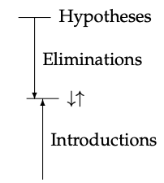
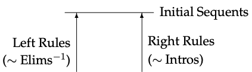

# Objetivos

## Objetivos

- Apresentar o formalismo do cálculo de sequentes.

## Objetivos

- Apresentar uma variante do cálculo de sequentes que 
pode ser usada para construção automática de demonstração.

## Objetivos 

- Apresentar a semântica de Kripke para lógica
proposicional.

# Introdução

## Introdução

- A dedução natural é um sistema formal para representar o 
raciocínio lógico de maneira precisa.

## Introdução

- Porém, a dedução natural não constitui um algoritmo para 
construção de demonstração.
    - Por que?

## Introdução 

- De maneira simples, o problema consiste na escolha **não determinística**
de qual deve ser a próxima regra a ser aplicada em uma demonstração.

## Introdução

- De acordo com Martin-Löf, o significado de uma proposição: 

"_The meaning of a proposition is determined by [...] what counts 
as a verification of it_"

## Introdução

- De maneira simples, o significado de um conectivo é determinado por suas
regras de introdução.

## Introdução

- Exemplo.

$$
\dfrac{\Gamma \vdash\varphi_1\:\:\:\:\Gamma\vdash\varphi_2}
      {\Gamma\vdash\varphi_1\land\varphi_2}
$$

## Introdução

- Se o significado é dado por regras de introdução, como considerar as 
regras de eliminação em deduções?

## Introdução

- Essa tensão entre regras de eliminação e introdução gera o não determinismo
em demonstrações.

## Introdução

- Origem da tensão: quando devemos deixar de usar regras de introdução e 
usar de eliminação (ou vice-versa)?

## Introdução

- Exemplo: Considere a tarefa de deduzir uma fórmula $\varphi$ a partir de um contexto 
que possua $\varphi' \supset \varphi$.

- Mas o que acontece se $\varphi'$ possui $\varphi$ como uma sub-fórmula?

## Introdução

- Mas o que acontece se $\varphi'$ possui $\varphi$ como uma sub-fórmula?

- Provavelmente o processo de dedução tentaria demonstrar $\varphi$ novamente 
levando a um processo sem fim...

## Introdução

- Exemplo: $\{(B\supset A) \supset A\} \vdash A$

## Introdução

- Exemplo $\{(B\supset A) \supset A\} \vdash A$

$$
\dfrac{(B \supset A) \supset A\:\:\:\:B\supset A}{A}
$$

## Introdução

- Exemplo $\{(B\supset A) \supset A\} \vdash A$

$$
\dfrac{
   \dfrac{}{(B \supset A) \supset A}\:\:\:\:
   \dfrac{}{B\supset A}
}{A}
$$

## Introdução

- Exemplo $\{(B\supset A) \supset A\} \vdash A$

$$
\dfrac{
   \dfrac{}{(B \supset A) \supset A}\:\:\:\:
   \dfrac{
      \dfrac{}{A}
   }{B\supset A}
}{A}
$$

## Introdução

- Exemplo $\{(B\supset A) \supset A\} \vdash A$

$$
\dfrac{
   \dfrac{}{(B \supset A) \supset A}\:\:\:\:
   \dfrac{
      \dfrac{
         \dfrac{}{(B \supset A) \supset A}\:\:\:\:
         \dfrac{\vdots}{B \supset A}
      }{A}
   }{B\supset A}
}{A}
$$

## Introdução

- Para evitar situações como a anterior, vamos restringir
o formato de deduções.

- A restrição evitará que deduções tenham redundâncias.

# Normal Natural Deduction

## Normal Natural Deduction

- A ideia é dividir as regras de dedução natural em dois formatos:
    - $\varphi\,\uparrow$: $\varphi$ possui uma dedução.
    - $\varphi\,\downarrow$: $\varphi$ pode ser usada em uma dedução.

## Normal Natural Deduction

- Como lidar com o contexto de hipóteses?

## Normal Natural Deduction

- O contexto $\Gamma$ é formado apenas por fórmulas que podem ser utilizadas
diretamente.

- Logo, representaremos um contexto por $\Gamma^{\downarrow}$ significando:

$$
\Gamma^{\downarrow} = \{\varphi_1\,\downarrow,...,\varphi_n\,\downarrow\}
$$

## Normal Natural Deduction

- Conjunção.

$$
\dfrac{\Gamma^{\downarrow}\vdash \varphi_1\,\uparrow\:\:\:\:
       \Gamma^{\downarrow}\vdash \varphi_2\,\uparrow}
      {\Gamma^{\downarrow}\vdash \varphi_1\land\varphi_2\,\uparrow}
$$

## Normal Natural Deduction

- Leitura: "Se temos deduções de $\varphi_1$ e $\varphi_2$, então podemos 
deduzir $\varphi_1\land\varphi_2$

$$
\dfrac{\Gamma^{\downarrow}\vdash \varphi_1\,\uparrow\:\:\:\:
       \Gamma^{\downarrow}\vdash \varphi_2\,\uparrow}
      {\Gamma^{\downarrow}\vdash \varphi_1\land\varphi_2\,\uparrow}
$$

## Normal Natural Deduction

- Conjunção.

$$
\begin{array}{cc}
   \dfrac{\Gamma^{\downarrow}\vdash\varphi_1\land\varphi_2\,\downarrow}
         {\Gamma^{\downarrow}\vdash\varphi_1} &
   \dfrac{\Gamma^{\downarrow}\vdash\varphi_1\land\varphi_2\,\downarrow}
         {\Gamma^{\downarrow}\vdash\varphi_2} 
\end{array}
$$

## Normal Natural Deduction 

- Leitura: "Se podemos usar $\varphi_1 \land \varphi_2$ então podemos 
utilizar $\varphi_1$".

$$
   \dfrac{\Gamma^{\downarrow}\vdash\varphi_1\land\varphi_2\,\downarrow}
         {\Gamma^{\downarrow}\vdash\varphi_1}
$$

## Normal Natural Deduction

- Implicação

$$
\dfrac{\Gamma^{\downarrow},\varphi_1\,\downarrow\vdash\varphi_2\,\uparrow}
      {\Gamma^{\downarrow}\vdash\varphi_1\supset\varphi_2\,\uparrow}
$$

## Normal Natural Deduction 

- Implicação

$$
\dfrac{\Gamma^{\downarrow}\vdash\varphi_1\supset\varphi_2\,\downarrow\:\:\:\:
       \Gamma^{\downarrow}\vdash\varphi_1\,\uparrow}
      {\Gamma^{\downarrow}\vdash \varphi_2\,\downarrow}
$$

## Normal Natural Deduction

- Disjunção 

$$
\begin{array}{cc}
   \dfrac{\Gamma^{\downarrow}\vdash\varphi_1\,\uparrow}
         {\Gamma^{\downarrow}\vdash\varphi_1\lor\varphi_2\,\uparrow} & 
   \dfrac{\Gamma^{\downarrow}\vdash\varphi_2\,\uparrow}
         {\Gamma^{\downarrow}\vdash\varphi_1\lor\varphi_2\,\uparrow} 
\end{array}
$$

## Normal Natural Deduction 

- Disjunção 

$$
\dfrac{\Gamma^{\downarrow}\vdash \varphi_1\lor\varphi_2\,\downarrow\:\:\:\:
       \Gamma^{\downarrow},\varphi_1\,\downarrow\vdash\varphi\,\uparrow\:\:\:\:
       \Gamma^{\downarrow},\varphi_2\,\downarrow\vdash\varphi\,\uparrow}
      {\Gamma^{\downarrow}\vdash\varphi\,\uparrow}
$$

## Normal Natural Deduction

- Verdadeiro 
    - Efeito colateral: Não há como usar $\top$ como hipótese.

$$
  \dfrac{}{\Gamma^{\downarrow}\vdash\top\,\uparrow}
$$

## Normal Natural Deduction

- Falso 
    - Efeito colateral: Não há como introduzir $\bot$ diretamente.

$$
  \dfrac{\Gamma^{\downarrow}\vdash\bot\,\downarrow}
        {\Gamma^{\downarrow}\vdash\varphi_1\,\uparrow}
$$

## Normal Natural Deduction

- Como utilizar hipóteses?

$$
\dfrac{}{\Gamma'^{\downarrow},\varphi\uparrow,\Gamma^{\downarrow}\vdash\varphi\downarrow}
$$

## Normal Natural Deduction

- Porém, como alterar o modo de regras de introdução ($\uparrow$) para eliminação ($\downarrow$)?

## Normal Natural Deduction

- Para alterar o "modo", devemos usar a regra

$$
\dfrac{\Gamma^{\downarrow}\vdash \varphi\downarrow}
      {\Gamma^{\downarrow}\vdash\varphi\uparrow}
$$

## Normal Natural Deduction

- Ex.: $\{A\supset B\land C\downarrow\} \vdash (A\supset B) \land (A \supset C)\uparrow$.

## Normal Natural Deduction

- Ex.: $\{A\supset B\land C\downarrow\} \vdash (A\supset B) \land (A \supset C)\uparrow$.

$$
\dfrac{}{(A\supset B) \land (A \supset C)\uparrow}
$$

## Normal Natural Deduction

- Ex.: $\{A\supset B\land C\downarrow\} \vdash (A\supset B) \land (A \supset C)\uparrow$.

$$
\dfrac{A\supset B\uparrow\:\:\:\:
       A\supset C\uparrow
       }{(A\supset B) \land (A \supset C)\uparrow}
$$

## Normal Natural Deduction

- Ex.: $\{A\supset B\land C\downarrow\} \vdash (A\supset B) \land (A \supset C)\uparrow$.

$$
\dfrac{\dfrac{
          \dfrac{\dfrac{}{B\downarrow}}{B\uparrow}
       }{A\supset B\uparrow}\:\:\:\:
       \dfrac{
          \dfrac{\dfrac{}{C\downarrow}}{C\uparrow}
       }{A\supset C\uparrow}
       }{(A\supset B) \land (A \supset C)\uparrow}
$$

## Normal Natural Deduction

- Ex.: $\{A\supset B\land C\downarrow\} \vdash (A\supset B) \land (A \supset C)\uparrow$.

$$
\scriptscriptstyle{
    \dfrac{\dfrac{
          \dfrac{
              \dfrac{
                  \dfrac{}{B\land C \downarrow}
              }{B\downarrow}
          }{B\uparrow}
       }{A\supset B\uparrow}\:\:\:\:
       \dfrac{
          \dfrac{
             \dfrac{
                 \dfrac{}{B\land C \downarrow}}{C\downarrow}
           }{C\uparrow}
       }{A\supset C\uparrow}
       }{(A\supset B) \land (A \supset C)\uparrow}}
$$

## Normal Natural Deduction

- Ex.: $\{A\supset B\land C\downarrow\} \vdash (A\supset B) \land (A \supset C)\uparrow$.

$$
\scriptscriptstyle{
    \dfrac{\dfrac{
          \dfrac{
              \dfrac{
                  \dfrac{\dfrac{}{A \supset B\land C\downarrow}\:\:\:\:
                         \dfrac{
                         }{A\uparrow}}{B\land C \downarrow}
              }{B\downarrow}
          }{B\uparrow}
       }{A\supset B\uparrow}\:\:\:\:
       \dfrac{
          \dfrac{
             \dfrac{
                 \dfrac{\dfrac{}{A \supset B\land C\downarrow}\:\:\:\:
                         \dfrac{
                         }{A\uparrow}
                 }{B\land C \downarrow}}{C\downarrow}
           }{C\uparrow}
       }{A\supset C\uparrow}
       }{(A\supset B) \land (A \supset C)\uparrow}}
$$

## Normal Natural Deduction

- Ex.: $\{A\supset B\land C\downarrow\} \vdash (A\supset B) \land (A \supset C)\uparrow$.

$$
\scriptscriptstyle{
    \dfrac{\dfrac{
          \dfrac{
              \dfrac{
                  \dfrac{\dfrac{}{A \supset B\land C\downarrow}\:\:\:\:
                         \dfrac{
                             \dfrac{}{A\downarrow}
                         }{A\uparrow}}{B\land C \downarrow}
              }{B\downarrow}
          }{B\uparrow}
       }{A\supset B\uparrow}\:\:\:\:
       \dfrac{
          \dfrac{
             \dfrac{
                 \dfrac{\dfrac{}{A \supset B\land C\downarrow}\:\:\:\:
                         \dfrac{
                             \dfrac{}{A\downarrow}
                         }{A\uparrow}
                 }{B\land C \downarrow}}{C\downarrow}
           }{C\uparrow}
       }{A\supset C\uparrow}
       }{(A\supset B) \land (A \supset C)\uparrow}}
$$

## Normal Natural Deduction

- O sistema apresentado não permite a construção de deduções contendo
redundâncias.

- Dessa forma, dizemos que as deduções são "normais", no sentido que 
não podem ser reduzidas.

## Normal Natural Deduction

- O sistema de dedução normal marca o momento em que uma demonstração
deixa de usar regras de introdução para regras de eliminação usando
a regra 

$$
\dfrac{\Gamma^{\downarrow}\vdash \varphi\downarrow}
      {\Gamma^{\downarrow}\vdash\varphi\uparrow}
$$

## Normal Natural Deduction

- Apresentaremos um sistema similar à dedução natural normal em que 
a manipulação de contextos é explícita.

- Esse sistema é conhecido como cálculo de sequentes.

# Cálculo de Sequentes

## Introdução

- O cálculo de sequentes consiste de um sistema para construção de 
demonstrações desenvolvido por Gentzen.

## Introdução

- Nosso objetivo é usar o cálculo de sequentes como um formalismo
intermediário para um algoritmo de construção de demonstrações 
na lógica proposicional.

## Introdução

- Ao contrário da dedução natural, o cálculo de sequentes permite 
uma manipulação direta dos sequentes como um todo.

## Introdução

- O contexto de hipóteses deixa de ter um papel secundário (implícito)
em deduções.

## Introdução 

- No cálculo de sequentes, regras de eliminação de conectivos manipulam
diretamente o contexto de hipóteses.
    - Left rules.

## Introdução

- Regras de introdução manipulam apenas a conclusão de um sequente.
    - Right rules.
    
## Introdução

- Adicionalmente, não há mudança de direção nas deduções, como na dedução
natural. 
    
## Introdução

- Estrutura de demonstrações em normal natural deduction.

## Introdução

- Estrutura de demonstrações no cálculo de sequentes.

## Introdução

- As regras do cálculo de sequentes possuem o seguinte formato

$$
\Gamma \Longrightarrow \varphi
$$

## Sequent Calculus

- Regra à direita para a conjunção

$$
\dfrac{\Gamma\Longrightarrow\varphi_1\:\:\:\:
       \Gamma\Longrightarrow\varphi_2}
      {\Gamma\Longrightarrow\varphi_1\land\varphi_2}
$$

## Sequent Calculus

- Regras à esquerda para a conjunção

$$
\begin{array}{c}
    \dfrac{\Gamma,\varphi_1\land\varphi_2,\varphi_1\Longrightarrow\varphi}
          {\Gamma,\varphi_1\land\varphi_2\Longrightarrow\varphi}\\ \\
    \dfrac{\Gamma,\varphi_1\land\varphi_2,\varphi_2\Longrightarrow\varphi}
          {\Gamma,\varphi_1\land\varphi_2\Longrightarrow\varphi}
\end{array}
$$

## Sequent Calculus

- Regra à direita para implicação

$$
\dfrac{\Gamma,\varphi_1\Longrightarrow \varphi_2}
      {\Gamma\Longrightarrow \varphi_1\supset\varphi_2}
$$

## Sequent Calculus

- Regra à esquerda para implicação

$$
\dfrac{\Gamma,\varphi_1\supset\varphi_2\Longrightarrow \varphi_1\:\:\:\:
       \Gamma,\varphi_1\supset\varphi_2,\varphi_2\Longrightarrow \varphi}
      {\Gamma,\varphi_1\supset\varphi_2\Longrightarrow \varphi}
$$

## Sequent Calculus

- Regras à direita para disjunção 

$$
\begin{array}{cc}
  \dfrac{\Gamma\Longrightarrow\varphi_1}
        {\Gamma\Longrightarrow\varphi_1\lor\varphi_2} & 
  \dfrac{\Gamma\Longrightarrow\varphi_2}
        {\Gamma\Longrightarrow\varphi_1\lor\varphi_2} 
\end{array}
$$

## Sequent Calculus

- Regra à esquerda para disjunção

$$
\dfrac{\Gamma,\varphi_1\lor\varphi_2,\varphi_1\Longrightarrow\varphi\:\:\:\:
       \Gamma,\varphi_1\lor\varphi_2,\varphi_2\Longrightarrow\varphi}
      {\Gamma,\varphi_1\lor\varphi_2\Longrightarrow\varphi}
$$

## Sequent Calculus

- Regra para a constante verdadeiro

$$
\dfrac{}{\Gamma\Longrightarrow\top}
$$

## Sequent Calculus

- Regra para a constante falso 

$$
\dfrac{\Gamma\Longrightarrow\bot}{\Gamma\Longrightarrow\varphi}
$$

## Sequent Calculus

- Sequente inicial 

$$
\dfrac{}{\Gamma,\varphi\Longrightarrow\varphi}
$$

## Sequent Calculus

- Exemplo: $\Longrightarrow A \lor B \supset B \lor A$

$$
\dfrac{}
      {\Longrightarrow A \lor B \supset B \lor A}
$$

## Sequent Calculus

- Exemplo: $\Longrightarrow A \lor B \supset B \lor A$

$$
\dfrac{\{A\lor B\}\Longrightarrow B\lor A}
      {\Longrightarrow A \lor B \supset B \lor A}
$$

## Sequent Calculus

- Exemplo: $\Longrightarrow A \lor B \supset B \lor A$

$$
\dfrac{\dfrac{
          \dfrac{}{\{A\lor B, A\}\Longrightarrow B\lor A}\:\:\:\:
          \dfrac{}{\{A\lor B, B\}\Longrightarrow B\lor A}
       }{\{A\lor B\}\Longrightarrow B\lor A}}
      {\Longrightarrow A \lor B \supset B \lor A}
$$

## Sequent Calculus

- Exemplo: $\Longrightarrow A \lor B \supset B \lor A$

$$
\dfrac{\dfrac{
          \dfrac{
             \dfrac{}{\{A\lor B, A\}\Longrightarrow A}
          }{\{A\lor B, A\}\Longrightarrow B\lor A}\:\:\:\:
          \dfrac{
            \dfrac{}{\{A\lor B, B\}\Longrightarrow B}
          }{\{A\lor B, B\}\Longrightarrow B\lor A}
       }{\{A\lor B\}\Longrightarrow B\lor A}}
      {\Longrightarrow A \lor B \supset B \lor A}
$$

## Sequent Calculus

- O cálculo de sequentes é equivalente à dedução natural.

- Isto é, se $\Gamma\Longrightarrow\varphi$ se, e somente se, $\Gamma \vdash \varphi$.

## Sequent Calculus

- A demonstraçõa envolve dois passos...
    1. Mostrar que a dedução natural é equivalente à dedução natural normal.
    2. Mostrar que a dedução natural normal é equivalente ao cálculo de sequentes.

## Sequent Calculus

- Não é objetivo deste curso o estudo de detalhes dessa demonstração.

- Porém, é importante termos em mente que existe uma equivalência entre 
o cálculo de sequentes e a dedução natural.

## Sequent Calculus

- A importância dessa equivalência vem do fato que veremos uma versão do 
cálculo de sequentes que pode ser visto como um algoritmo para construção
de provas para lógica proposicional.

## Sequent Calculus

- A chave para este algoritmo é garantir sua terminação. Para isso, 
devemos obrigar que chamadas sejam feitas sobre argumentos "menores"
de acordo com alguma relação de ordem bem formada.

# Proof Search

## Proof Search

- Até o momento, estudamos dois formalismos para construir 
demonstrações da lógica proposicional.
    - Dedução natural
    - Cálculo de sequentes

## Proof Search

- Porém, como determinar se um sequente é ou não demonstrável?

## Proof Search

- Para entender o cálculo de sequentes como um formalismo para construção 
de demonstrações na lógica proposicional, temos que modificá-lo para 
garantir terminação.

## Proof Search

- Vamos representar a nova versão do cálculo de sequentes usando a notação 

$$
\Gamma \longrightarrow \varphi
$$

## Proof Search

- Veremos, que cada uma das regras "diminui" o tamanho do sequente. 
    - Tamanho: número de conectivos.

## Proof Search

- Conjunção

$$
\dfrac{\Gamma\longrightarrow\varphi_1\:\:\:\:
       \Gamma\longrightarrow\varphi_2}
      {\Gamma\longrightarrow\varphi_1\land\varphi_2}
$$

## Proof Search

- Conjunção

$$
\begin{array}{cc}
   \dfrac{\Gamma,\varphi_1,\varphi_2\longrightarrow\varphi}
         {\Gamma,\varphi_1\land\varphi_2\longrightarrow\varphi}
\end{array}
$$

## Proof Search

- Disjunção

$$
\begin{array}{cc}
   \dfrac{\Gamma\longrightarrow\varphi_1}
         {\Gamma\longrightarrow\varphi_1\lor\varphi_2} &
   \dfrac{\Gamma\longrightarrow\varphi_2}
         {\Gamma\longrightarrow\varphi_1\lor\varphi_2}
\end{array}
$$

## Proof Search

- Disjunção

$$
\dfrac{\Gamma,\varphi_1\longrightarrow\varphi\:\:\:\:
       \Gamma,\varphi_2\longrightarrow\varphi}
      {\Gamma,\varphi_1\lor\varphi_2\longrightarrow\varphi}
$$

## Proof Search

- Constante verdadeiro 
   - Podemos remover $\top$ à esquerda.
$$
\begin{array}{cc}
   \dfrac{}{\Gamma\longrightarrow\top} & 
   \dfrac{\Gamma\longrightarrow\varphi}
         {\Gamma,\top\longrightarrow\varphi}
\end{array}
$$

## Proof Search 

- Constante falso 

$$
\dfrac{}{\Gamma,\bot\longrightarrow\varphi}
$$

## Proof Search 

- A regra de hipóteses é válida apenas para variáveis.

$$
\dfrac{}{\Gamma,A\longrightarrow A}
$$

## Proof Search

- Implicação

$$
\dfrac{\Gamma,\varphi_1 \longrightarrow \varphi_2}
      {\Gamma\longrightarrow\varphi_1\supset\varphi_2}
$$

## Proof Search

- Todas as regras possuem premissas com "tamanho" menor que 
o da conclusão.

## Proof Search

- Com isso, temos que o processo de construção de provas é 
garantido de terminar.
    - Não é possível produzir sequentes de tamanho menor
      indefinidamente. 
      
## Proof Search

- Mas, e a regra à esquerda para a implicação?

$$
\dfrac{\Gamma,\varphi_1\supset\varphi_2\longrightarrow\varphi_1\:\:\:\:
       \Gamma,\varphi_2\longrightarrow\varphi}
      {\Gamma,\varphi_1\supset\varphi_2\longrightarrow\varphi}
$$

## Proof Search

- Note que as premissas não possuem tamanho menor que o da conclusão...

$$
\dfrac{\Gamma,\varphi_1\supset\varphi_2\longrightarrow\varphi_1\:\:\:\:
       \Gamma,\varphi_2\longrightarrow\varphi}
      {\Gamma,\varphi_1\supset\varphi_2\longrightarrow\varphi}
$$

## Proof Search 

- Como resolver esse problema?

## Proof Search 

- Vamos refinar o antecedente da implicação para que os antecedentes possuam
tamanho menor que a conclusão.

- Esse refinamento irá definir uma nova regra para cada forma do antecendente.

## Proof Search

- Antecedente: constante verdadeiro 

$$
\dfrac{\Gamma,\varphi_2\longrightarrow\varphi}
      {\Gamma,\top\supset\varphi_2\longrightarrow\varphi}
$$

## Proof Search

- Antecedente: disjunção 

$$
\dfrac{\Gamma,\varphi_1\supset\varphi_3,\varphi_2\supset\varphi_3\longrightarrow\varphi}
      {\Gamma,(\varphi_1\lor\varphi_2)\supset\varphi_3\longrightarrow\varphi}
$$

## Proof Search

- Mas o sequente 

$$
\Gamma,\varphi_1\supset\varphi_3,\varphi_2\supset\varphi_3\longrightarrow\varphi
$$

é menor que 

$$
\Gamma,(\varphi_1\lor\varphi_2)\supset\varphi_3\longrightarrow\varphi
$$

??

## Proof Search

- Sim! Basta considerar uma ordem sobre conjunto com repetição de elementos.

- Estamos substituindo a fórmula $(\varphi_1\lor\varphi_2)\supset\varphi_3$
  por duas de tamanho menor.
    - $\varphi_1\supset\varphi_3$
    - $\varphi_2\supset\varphi_3$

## Proof Search 

- Antecendente: conjunção 

$$
\dfrac{\Gamma,\varphi_1\supset(\varphi_2\supset\varphi_3)\longrightarrow\varphi}
      {\Gamma,(\varphi_1\land\varphi_2)\supset\varphi_3\longrightarrow\varphi}
$$

## Proof Search

- Basta considerar que a conjunção tem um peso de 2 e os demais conectivos da lógica
tem peso 1.

## Proof Search

- Antecedente: variável 

$$
\dfrac{A\in\Gamma\:\:\:\:\Gamma,\varphi_2\longrightarrow\varphi}
      {\Gamma,A \supset\varphi_2\longrightarrow\varphi}
$$

## Proof Search 

- Antecedente: implicação 

$$
\dfrac{\Gamma,\varphi_2\supset\varphi_3,\varphi_1\longrightarrow\varphi_2\:\:\:\:
       \Gamma,\varphi_3\longrightarrow\varphi}
      {\Gamma,(\varphi_1\supset\varphi_2)\supset\varphi_3\longrightarrow\varphi}
$$

# Semântica de Kripke

# Referências

## Referências

- MARTIN-LÖF, Per. On the meaning of logical constants and the justification
of logical laws. Nordic Journal of Philosophical Logic, 1(1): 11-60, 1996.

## Referências

- GENTZEN, Gerhard. Untersuchungen uber das logische Schließen. Mathematische Zeitschrift, 
39:176–210, 405–431, 1935. English translation in M. E. Szabo, editor, 
The Collected Papers of Gerhard Gentzen, pages 68–131, North-Holland, 1969

## Referências

- DYCKHOFF, Roy. Contraction-free sequent calculi for intuitionistic
logic. Journal of Symbolic Logic, 57:795–807, 1992.
