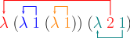

# Objetivos

## Objetivos

- Apresentar a sintaxe e semântica do $\lambda$-cálculo 
não tipado.

## Objetivos

- Apresentar como o $\lambda$-cálculo pode ser utilizado 
como uma linguagem de programação.

## Objetivos

- Apresentar uma implementação de um interpretador 
do $\lambda$-cálculo.

- Discutir índices De Bruijn para a implementação do 
$\lambda$-cálculo.

# Motivação

## Motivação

- Para entendermos a relação entre linguagens funcionais
e lógica, precisamos entender o núcleo destas linguagens.

## Motivação

- Para isso, vamos introduzir o $\lambda$-cálculo não tipado
para entendermos a semântica deste formalismo e também 
aspectos de sua implementação.

# Sintaxe

## Sintaxe

- Para a sintaxe do $\lambda$-cálculo, vamos considerar 
  um conjunto enumerável de símbolos denominados variáveis.
  
## Sintaxe

- Definimos a sintaxe de termos do $\lambda$-cálculo usando a
  seguinte gramática livre de contexto.

$$
\begin{array}{lcll}
  e & \to  & x            & \text{variáveis}\\
    & \mid & e\:e         & \text{aplicação}\\
    & \mid & \lambda\,x.e & \text{abstração}\\
\end{array}
$$

## Sintaxe

- Exemplos

$$
\begin{array}{c}
   \lambda x. x\\
   (\lambda x.(xx))(\lambda y. (x\,y))\\
   \lambda x.(\lambda y. (x\,(\lambda z.y)))\\
\end{array}
$$

## Sintaxe

- Escopo: O escopo da variável x em $\lambda x. e$ é o termo e.

## Sintaxe

- Variáveis livres e ligadas: Dizemos que uma variável é ligada se
  ela ocorre no escopo de uma abstração e livre, caso contrário.

- Denotamos por $FV(e)$ o conjunto de variáveis livres de um termo.

## Sintaxe 

- Função para cálculo do conjunto de variáveis livres.

$$
\begin{array}{lcl}
  FV(x)           & = & \{x\}\\
  FV(e\:e')       & = & FV(e)\cup FV(e')\\
  FV(\lambda x.e) & = & FV(e) - \{x\}\\
\end{array}
$$

## Sintaxe

- Dizemos que um termo $t$ é fechado se $FV(t) = \emptyset$.

## Sintaxe

- Considere os seguintes termos
    - $\lambda x.x$
    - $\lambda y.y$

## Sintaxe

- Considere os seguintes termos
    - $\lambda x.x$
    - $\lambda y.y$
- Note que esses termos denotam a mesma função. 
    - Como definir essa equivalência formalmente?
    
## Sintaxe

- Antes de definir essa equivalência, precisamos formalizar a 
noção de renomeamento de variáveis.

## Sintaxe

- Renomeamento de variáveis: $e\,\{x\mapsto y\}$.

$$
\begin{array}{lcl}
  x\,\{x\mapsto y\} & = & y \\
\end{array}
$$

## Sintaxe

- Renomeamento de variáveis: $e\,\{x\mapsto y\}$.

$$
\begin{array}{lcll}
  x\,\{x\mapsto y\} & = & y \\
  z\,\{x\mapsto y\} & = & z\:\:\textrm{ se } z \neq x\\
\end{array}
$$

## Sintaxe

- Renomeamento de variáveis: $e\,\{x\mapsto y\}$.

$$
\begin{array}{lcll}
  x\,\{x\mapsto y\} & = & y \\
  z\,\{x\mapsto y\} & = & z\:\:\textrm{ se } z \neq x\\
  (e\:e')\{x\mapsto y\} & = & (e\,\{x\mapsto y\})\:(e'\,\{x\mapsto y\}) \\
\end{array}
$$

## Sintaxe

- Renomeamento de variáveis: $e\,\{x\mapsto y\}$.

$$
\begin{array}{lcll}
  x\,\{x\mapsto y\} & = & y \\
  z\,\{x\mapsto y\} & = & z\:\:\textrm{ se } z \neq x\\
  (e\:e')\{x\mapsto y\} & = & (e\,\{x\mapsto y\})\:(e'\,\{x\mapsto y\}) \\
  (\lambda x.e)\{x\mapsto y\} & = & \lambda x.e\\
\end{array}
$$

## Sintaxe

- Renomeamento de variáveis: $e\,\{x\mapsto y\}$.

$$
\begin{array}{lcl}
  x\,\{x\mapsto y\} & = & y \\
  z\,\{x\mapsto y\} & = & z\:\:\textrm{ se } z \neq x\\
  (e\:e')\{x\mapsto y\} & = & (e\,\{x\mapsto y\})\:(e'\,\{x\mapsto y\}) \\
  (\lambda x.e)\{x\mapsto y\} & = & \lambda x.e\\
  (\lambda y.e)\{x\mapsto y\} & = & \lambda x.(e\,\{x\mapsto y\})\\
\end{array}
$$

## Sintaxe

- Renomeamento de variáveis: $e\,\{x\mapsto y\}$.

$$
\begin{array}{lcll}
  x\,\{x\mapsto y\} & = & y \\
  z\,\{x\mapsto y\} & = & z\:\:\textrm{se } z \neq x\\
  (e\:e')\{x\mapsto y\} & = & (e\,\{x\mapsto y\})\:(e'\,\{x\mapsto y\}) \\
  (\lambda x.e)\{x\mapsto y\} & = & \lambda x.e\\
  (\lambda y.e)\{x\mapsto y\} & = & \lambda x.(e\,\{x\mapsto y\})\\
  (\lambda z.e)\{x\mapsto y\} & = & \lambda z.(e\,\{x\mapsto y\})\:\:\textrm{se }z\neq x\\
                              &   & \:\:\:\:\:\:\:\:\:\:\:\:\:\:\:\:\:\:\:\:\:\:\:\:\:\:\:\:\:\:\:\:\:\:\:\:z \neq y
\end{array}
$$

## Sintaxe

- Dizemos que dois termos são $\alpha$-equivalentes se existe uma forma de 
renomear variáveis ligadas de forma a torná-los iguais.

- Denotamos essa equivalência como $e \equiv_{\alpha} e'$.

## Sintaxe 

- A relação de $\alpha$-equivalência é definida como o seguinte conjunto de 
regras.

$$
\begin{array}{c}
   \dfrac{y\not\in FV(e)}
         {\lambda x.e \equiv_{\alpha} \lambda y. (e\,\{x\mapsto y\})}
\end{array}
$$


## Sintaxe 

- A relação de $\alpha$-equivalência é definida como o seguinte conjunto de 
regras.

$$
\begin{array}{c}
   \dfrac{e_1\equiv_{\alpha} e'_1\:\:\:\:
          e_2\equiv_{\alpha} e'_2}
         {e_1\:e_2\equiv_{\alpha}e'_1\:e'_2}
\end{array}
$$

## Sintaxe 

- A relação de $\alpha$-equivalência é definida como o seguinte conjunto de 
regras.

$$
\begin{array}{c}
   \dfrac{e\equiv_{\alpha} e'}
         {\lambda x.e\equiv_{\alpha}\lambda x.e'}
\end{array}
$$

## Sintaxe 

- A relação de $\alpha$-equivalência é definida como o seguinte conjunto de 
regras.

$$
\begin{array}{c}
   \dfrac{}
         {e\equiv_{\alpha}e}
\end{array}
$$

## Sintaxe 

- A relação de $\alpha$-equivalência é definida como o seguinte conjunto de 
regras.

$$
\begin{array}{c}
   \dfrac{e'\equiv_{\alpha}e}
         {e\equiv_{\alpha}e'}
\end{array}
$$

## Sintaxe 

- A relação de $\alpha$-equivalência é definida como o seguinte conjunto de 
regras.

$$
\begin{array}{c}
   \dfrac{e_1\equiv_{\alpha}e_2\:\:\:\:
          e_2\equiv_{\alpha}e_3}
         {e_1\equiv_{\alpha}e_3}
\end{array}
$$

# Semântica

- Antes de apresentar a semântica do $\lambda$-cálculo, é necessário
  definir a operação de substituição.

## Semântica 

- A substituição de x por e' em e, $[x \mapsto e']e$, é definida por recursão sobre e:

$$
\begin{array}{lcl}
  [x\mapsto e']x          & = & e'\\
  [x\mapsto e']a          & = & a,\:\:\:a\not\equiv x\\
  [x\mapsto e'](e_1\,e_2) & = & ([x\mapsto e']e_1)([x\mapsto e']e_2)\\
\end{array}
$$

## Semântica 

- A substituição de x por e' em e, $[x \mapsto e']e$, é definida por recursão sobre e:

$$
\begin{array}{lcl}
  [x\mapsto e'](\lambda x. e) & = & \lambda x. e\\
  [x\mapsto e'](\lambda y. e) & = & \lambda y. e,\:\:\:x\not\in FV(e)\\
  [x\mapsto e'](\lambda y. e) & = & \lambda y. [x\mapsto e'] e, \:\: x \in FV(e)\land \\
                              &   & y\not\in FV(e')\\
  [x\mapsto e'](\lambda y. e) & = & \lambda z. [x\mapsto e'][y \mapsto  z] e,\\ 
                              &   & \:\:\:\:x \in FV(e) \land y \in FV(e').
\end{array}
$$

## Semântica 

- A semântica do $\lambda$-cálculo é definida em termos da chamada $\beta$-redução.

## Semântica

- Um termo da forma: $(\lambda x. e)\:e'$ denota
    - uma função de um argumento $x$
    - um argumento $e'$
- Como calcular o resultado desta _chamdada de função_?

## Semântica

- O resultado consiste em substituir ocorrências livres de 
$x$ em $e$ por $e'$. Formalmente:

$$
(\lambda x.e)\,e'\rightarrow_{\beta}[x\mapsto e']e
$$

## Semântica

- A relação de $\beta$-redução é definda pelas seguintes regras.

$$
\dfrac{}{(\lambda x.e)\,e'\rightarrow_{\beta}[x\mapsto e']e}
$$

## Semântica

- A relação de $\beta$-redução é definda pelas seguintes regras.

$$
\dfrac{e \rigtharrow_{\beta}e'}
      {\lambda x. e \rightarrow_{\beta} e'}
$$

## Semântica

- A relação de $\beta$-redução é definda pelas seguintes regras.

$$
\dfrac{e_1 \rigtharrow_{\beta}e'_1}
      {e_1\:e_2 \rightarrow_{\beta} e'_1\:e_2}
$$

## Semântica

- A relação de $\beta$-redução é definda pelas seguintes regras.

$$
\dfrac{e_2 \rigtharrow_{\beta}e'_2}
      {e_1\:e_2 \rightarrow_{\beta} e_1\:e'_2}
$$

## Semântica 

- Exemplo: reduzir o termo $\lambda x. (\lambda y. y)\,x\,z$.

$$
\dfrac{}
      {\lambda x. (\lambda y. y)\,x\,z \to_{\beta}}
$$


## Semântica 

- Exemplo: reduzir o termo $\lambda x. (\lambda y. y)\,x\,z$.

$$
\dfrac{
   \dfrac{}
         {(\lambda y.y)\,x\,z\to_{\beta}}
}{\lambda x. (\lambda y. y)\,x\,z \to_{\beta}}
$$

## Semântica 

- Exemplo: reduzir o termo $\lambda x. (\lambda y. y)\,x\,z$.

$$
\dfrac{
   \dfrac{[y \mapsto x] y \to_{\beta} x}
         {(\lambda y.y)\,x\,z\to_{\beta} x\,z}
}{\lambda x. (\lambda y. y)\,x\,z \to_{\beta}\lambda x.x\,z}
$$

## Semântica

- A redução é **não determinística**

$$
\begin{array}{l}
(\lambda x\,y.y)((\lambda x. x)(\lambda x.x))\to_{\beta}\\
(\lambda x\,y.y)(\lambda x. x) 
\end{array}
$$

## Semântica

- A redução é **não determinística**

$$
\begin{array}{l}
(\lambda x\,y.y)((\lambda x. x)(\lambda x.x))\to_{\beta}\\
(\lambda y.y)
\end{array}
$$

## Semântica

- Se a redução é não determinística, reduções diferentes podem 
produzir resultados diferentes?

## Semântica

- A resposta é **NÃO**!

- O $\lambda$-cálculo possui uma propriedade conhecida como _confluência_
que garante que todo termo produzirá o mesmo resultado, independente da 
estratégia de redução usada.


# Programando em $\lambda$-cálculo

## Programando em $\lambda$-cálculo

- O $\lambda$-cálculo é um formalismo capaz de representar toda
  função computável.

- Para ilustrar, vamos apresentar algumas funções conhecidas
  usando o $\lambda$-cálculo.

## Programando em $\lambda$-cálculo

- Representando booleanos
  - True: $\lambda x y. x$
  - False: $\lambda x y. y$

## Programando em $\lambda$-cálculo

- A função de conjunção é representada pelo seguinte termo:
   - False é o termo $\lambda x y . y$
$$
\begin{array}{l}
  and \equiv \lambda a b. a\,b\,False
\end{array}
$$

## Programando em $\lambda$-cálculo

- Exemplo

$$
\begin{array}{lc}
  and\:True\:True & = \\
\end{array}
$$

## Programando em $\lambda$-cálculo

- Exemplo

$$
\begin{array}{lc}
  and\:True\:True & = \\
  (\lambda a b. a\,b\,False)\,True\:True & =\\
\end{array}
$$

## Programando em $\lambda$-cálculo

- Exemplo

$$
\begin{array}{lc}
  and\:True\:True & = \\
  (\lambda a b. a\,b\,False)\,True\:True & =\\
  True\,True\,False & =\\
\end{array}
$$

## Programando em $\lambda$-cálculo

- Exemplo

$$
\begin{array}{lc}
  and\:True\:True & = \\
  (\lambda a b. a\,b\,False)\,True\:True & =\\
  True\,True\,False & =\\
  (\lambda x y. x)\,(\lambda x y . x)\,(\lambda x y. y) & =\\
\end{array}
$$

## Programando em $\lambda$-cálculo

- Exemplo

$$
\begin{array}{lc}
  and\:True\:True & = \\
  (\lambda a b. a\,b\,False)\,True\:True & =\\
  True\,True\,False & =\\
  (\lambda x y. x)\,(\lambda x y . x)\,(\lambda x y. y) & =\\
  [(\lambda x y . x)\,/\,x;\lambda x y. y\,/\,y] x & =\\
\end{array}
$$

## Programando em $\lambda$-cálculo

- Exemplo

$$
\begin{array}{lc}
  and\:True\:True & = \\
  (\lambda a b. a\,b\,False)\,True\:True & =\\
  True\,True\,False & =\\
  (\lambda x y. x)\,(\lambda x y . x)\,(\lambda x y. y) & =\\
  [(\lambda x y . x)\,/\,x;\lambda x y. y\,/\,y] x & =\\
  \lambda x y . x & =\\
\end{array}
$$

## Programando em $\lambda$-cálculo

- Exemplo

$$
\begin{array}{lc}
  and\:True\:True & = \\
  (\lambda a b. a\,b\,False)\,True\:True & = \\
  True\,True\,False & = \\
  (\lambda x y. x)\,(\lambda x y . x)\,(\lambda x y. y) & = \\
  [(\lambda x y . x)\,/\,x;\lambda x y. y\,/\,y] x & =\\
  \lambda x y . x & =\\
  True
\end{array}
$$

## Programando em $\lambda$-cálculo

- Pode-se representar números naturais utilizando a notação de Peano.
  - zero \in $\mathbb{N}$
  - se n \in $\mathbb{N}$ então succ n \in $\mathbb{N}$

## Programando em $\lambda$-cálculo

- Representando números naturais

$$
\begin{array}{lcl}
  \overline{0} & = & \lambda s z. z \\
  \overline{1} & = & \lambda s z. s z \\
  \overline{2} & = & \lambda s z. s (s z) \\
  \overline{3} & = & \lambda s z. s (s (s z)) \\
   ...
\end{array}
$$

## Programando em $\lambda$-cálculo

- Representando números naturais:
  - Se n \in $\mathbb{N}$ então $\overline{n} = \lambda s z. s^n z$.

## Programando em $\lambda$-cálculo

- Como representar uma função para calcular o sucessor de um número natural?

- A função deve computar $\overline{n+1}$ a partir de $\overline{n}$.

## Programando em $\lambda$-cálculo

- Logo, devemos obter um termo $f$ tal que:
$$
\begin{array}{c}
  f(\overline{n}) = \lambda s z . s^{n + 1} z\\
\end{array}
$$

## Programando em $\lambda$-cálculo

- Mas, temos que

$$
\begin{array}{lc}
  \lambda s z . s^{n + 1} z & \equiv_{\beta}\\
\end{array}
$$

## Programando em $\lambda$-cálculo

- Mas, temos que

$$
\begin{array}{lc}
  \lambda s z . s^{n + 1} z & \equiv_{\beta}\\
  \lambda s z . s (s^n z)   & \equiv_{\beta}\\
\end{array}
$$


## Programando em $\lambda$-cálculo

- Mas, temos que

$$
\begin{array}{lc}
  \lambda s z . s^{n + 1} z & \equiv_{\beta}\\
  \lambda s z . s (s^n z)   & \equiv_{\beta}\\
  \lambda s z . s ((\lambda s n. s^n z) s z) \\
\end{array}
$$

## Programando em $\lambda$-cálculo

- Porém, $\overline{n} = \lambda s n. s^n z$:

$$
\begin{array}{lc}
  \lambda s z . s^{n + 1} z & \equiv_{\beta}\\
  \lambda s z . s (s^n z)   & \equiv_{\beta}\\
  \lambda s z . s ((\lambda s n. s^n z) s z) \\
  \lambda s z . s (\overline{n} s z) \\
\end{array}
$$

## Programando em $\lambda$-cálculo

- Abstraindo sobre $\overline{n}$, obtemos:

$$
\begin{array}{l}
  succ \equiv \lambda n s z . s (n s z) \\
\end{array}
$$

## Programando em $\lambda$-cálculo

- Exemplo

$$
\begin{array}{lc}
   succ(\overline{n}) & \equiv \\
\end{array}
$$

## Programando em $\lambda$-cálculo

- Exemplo

$$
\begin{array}{lc}
   succ(\overline{n}) & \equiv \\
   \lambda n s z . s (n s z) (\overline{n}) & \to_{\beta} \\
\end{array}
$$

## Programando em $\lambda$-cálculo

- Exemplo

$$
\begin{array}{lc}
   succ(\overline{n}) & \equiv \\
   \lambda n s z . s (n s z) (\overline{n}) & \to_{\beta} \\
   \lambda s z . s (\overline{n} s z) & \equiv \\
\end{array}
$$

## Programando em $\lambda$-cálculo

- Exemplo

$$
\begin{array}{lc}
   succ(\overline{n}) & \equiv \\
   \lambda n s z . s (n s z) (\overline{n}) & \to_{\beta} \\
   \lambda s z . s (\overline{n} s z) & \equiv \\
   \lambda s z . s ((\lambda s z. s^n z) s z) & \to_{\beta} \\
\end{array}
$$

## Programando em $\lambda$-cálculo

- Exemplo

$$
\begin{array}{lc}
   succ(\overline{n}) & \equiv \\
   \lambda n s z . s (n s z) (\overline{n}) & \to_{\beta} \\
   \lambda s z . s (\overline{n} s z) & \equiv \\
   \lambda s z . s ((\lambda s z. s^n z) s z) & \to_{\beta} \\
   \lambda s z . s ((\lambda z. s^n z) z) & \to_{\beta}\\
\end{array}
$$

## Programando em $\lambda$-cálculo

- Exemplo

$$
\begin{array}{lc}
   succ(\overline{n}) & \equiv \\
   \lambda n s z . s (n s z) (\overline{n}) & \to_{\beta} \\
   \lambda s z . s (\overline{n} s z) & \equiv \\
   \lambda s z . s ((\lambda s z. s^n z) s z) & \to_{\beta} \\
   \lambda s z . s ((\lambda z. s^n z) z) & \to_{\beta}\\
   \lambda s z . s (s^n z) & \equiv \\
\end{array}
$$

## Programando em $\lambda$-cálculo

- Exemplo

$$
\begin{array}{lc}
   succ(\overline{n}) & \equiv \\
   \lambda n s z . s (n s z) (\overline{n}) & \to_{\beta} \\
   \lambda s z . s (\overline{n} s z) & \equiv \\
   \lambda s z . s ((\lambda s z. s^n z) s z) & \to_{\beta} \\
   \lambda s z . s ((\lambda z. s^n z) z) & \to_{\beta}\\
   \lambda s z . s (s^n z) & \equiv \\
   \lambda s z . s^{n + 1} z & \equiv \\
\end{array}
$$

## Programando em $\lambda$-cálculo

- Exemplo

$$
\begin{array}{lc}
   succ(\overline{n}) & \equiv \\
   \lambda n s z . s (n s z) (\overline{n}) & \to_{\beta} \\
   \lambda s z . s (\overline{n} s z) & \equiv \\
   \lambda s z . s ((\lambda s z. s^n z) s z) & \to_{\beta} \\
   \lambda s z . s ((\lambda z. s^n z) z) & \to_{\beta}\\
   \lambda s z . s (s^n z) & \equiv \\
   \lambda s z . s^{n + 1} z & \equiv \\
   \overline{n+1}
\end{array}
$$

## Programando em $\lambda$-cálculo

- Pontos fixos: dizemos que x é ponto fixo de f se f(x) = x.

- Ao contrário de funções da análise, funções do $\lambda$-cálculo
  sempre possuem um ponto fixo.

## Programando em $\lambda$-cálculo

- Podemos mostrar esse fato facilmente. Para isso, considere:
   - $A = \lambda x y. y (xxy)$
   - $\Theta = AA$

## Programando em $\lambda$-cálculo

- Seja $e$ um termo qualquer. O ponto fixo de $f$ é dado por
  $x = \Theta f$.

$$
\begin{array}{lc}
  x & \equiv\\
\end{array}
$$

## Programando em $\lambda$-cálculo

- Seja $e$ um termo qualquer. O ponto fixo de $f$ é dado por
  $x = \Theta f$.

$$
\begin{array}{lc}
  x & \equiv\\
  \Theta f & \equiv \\
\end{array}
$$

## Programando em $\lambda$-cálculo

- Seja $e$ um termo qualquer. O ponto fixo de $f$ é dado por
  $x = \Theta f$.

$$
\begin{array}{lc}
  x & \equiv\\
  \Theta f & \equiv \\
  AA f     & \equiv \\
\end{array}
$$

## Programando em $\lambda$-cálculo

- Seja $e$ um termo qualquer. O ponto fixo de $f$ é dado por
  $x = \Theta f$.

$$
\begin{array}{lc}
  x & \equiv\\
  \Theta f & \equiv \\
  AA f     & \equiv \\
  (\lambda x y. y(xx y))A f & \to^*_\beta\\
\end{array}
$$

## Programando em $\lambda$-cálculo

- Seja $e$ um termo qualquer. O ponto fixo de $f$ é dado por
  $x = \Theta f$.

$$
\begin{array}{lc}
  x & \equiv\\
  \Theta f & \equiv \\
  AA f     & \equiv \\
  (\lambda x y. y(xx y))A f & \to^*_\beta\\
  f (A A f) & \equiv \\
\end{array}
$$

## Programando em $\lambda$-cálculo

- Seja $e$ um termo qualquer. O ponto fixo de $f$ é dado por
  $x = \Theta f$.

$$
\begin{array}{lc}
  x & \equiv\\
  \Theta f & \equiv \\
  AA f     & \equiv \\
  (\lambda x y. y(xx y))A f & \to^*_\beta\\
  f (A A f) & \equiv \\
  f (\Theta f) & \equiv \\
\end{array}
$$

## Programando em $\lambda$-cálculo

- Seja $e$ um termo qualquer. O ponto fixo de $f$ é dado por
  $x = \Theta f$.

$$
\begin{array}{lc}
  x & \equiv\\
  \Theta f & \equiv \\
  AA f     & \equiv \\
  (\lambda x y. y(xx y))A f & \to^*_\beta\\
  f (A A f) & \equiv \\
  f (\Theta f) & \equiv \\
  f(x)
\end{array}
$$

## Programando em $\lambda$-cálculo

- Podemos usar o $\lambda$-cálculo para definir estruturas de dados
  como tuplas e listas.

## Programando em $\lambda$-cálculo

- Pares: Se $e_1, e_2$ são $\lambda$-termos então o par $(e_1,e_2)$ pode
  ser representado pelo termo:

$$
\begin{array}{l}
  \lambda z. z e_1 e_2
\end{array}
$$

## Programando em $\lambda$-cálculo

- Projeções:
  - fst = $\lambda p.p (\lambda x y. x)$
  - snd = $\lambda p.p (\lambda x y. y)$

## Programando em $\lambda$-cálculo

- Tuplas são representadas de maneira similar.

- Se $e_1, ..., e_n$ são \lambda-termos então a n-upla $(e_1,...,e_n)$ é
  representada pelo seguinte termo

$$
\begin{array}{l}
  \lambda z. z e_1 ... e_n
\end{array}
$$

## Programando em $\lambda$-cálculo

- Projeções podem também ser generalizadas de forma imediata.

$$
\begin{array}{l}
  \pi^{n}_{i} = \lambda z. z (\lambda x_1 ... x_n . x_i)
\end{array}
$$

## Programando em $\lambda$-cálculo

- Listas: são formadas por dois construtores
  - nil: representando a lista vazia
  - h:t : lista formada por um primeiro elemento h e uma causa t.

## Programando em $\lambda$-cálculo

- Representando o construtor nil:

$$
\begin{array}{l}
nil = \lambda x y. y
\end{array}
$$

## Programando em $\lambda$-cálculo

- Representando o construtor h:t

$$
\begin{array}{l}
h:t = \lambda x y. x h t
\end{array}
$$

## Programando em $\lambda$-cálculo

- No repositório on-line da disciplina, há um 
interpretador do $\lambda$-cálculo. 

- Você poderá usá-lo para experimentar um pouco 
com programar com o $\lambda$-cálculo.

## Programando em $\lambda$-cálculo 

- Vamos considerar agora como implementar o 
$\lambda$-cálculo.

- Para isso, vamos utilizar a linguagem Haskell.

# Implementação

## Implementação 

- Vamos considerar a tarefa de implementar um 
interpretador para o $\lambda$-cálculo.

## Implementação

- Para isso, vamos usar uma técnica conhecida como
_normalization by evaluation_.

## Implementação

- Normalization by evaluation: utilizar o mecanismo de 
execução da linguagem _host_ para realizar computações 
da linguagem a ser definida.

## Implementação

- Isto é, usaremos o mecanismo de execução de Haskell
para executar nossa definição do $\lambda$-cálculo.

- Essa técnica é amplamente utilizada em assistentes 
de provas como Coq, Agda e Idris.

## Implementação

- A vantagem desta técnica é que não é necessário
codificar a operação de substituição.

- Usaremos o mecanismo já implementado na 
linguagem Haskell.


## Implementação

- Representando a sintaxe:

```haskell
data Term
  = Var Name
  | Term :@: Term
  | Lam Name Term
```

## Implementação

- O resultado da computação de um $\lambda$-termo 
é descrito pela seguinte gramática:

$$
v \to \lambda x . e \,\mid\,x\:v_1\hdotsv_n
$$

## Implementação 

- Representando valores 
    - Funções são representadas como funções da linguagem Haskell

```haskell
data Value
  = VAbs (Value -> Value)
  | VNeutral Neutral
```

## Implementação

- Representando valores

```haskell 
data Neutral
  = NVar Name
  | NApp Neutral Value
```

## Implementação

- A chave da normalization by evaluation é usar a própria 
linguagem Haskell para realizar a substituição necessária 
para o $\lambda$-cálculo.

## Implementação 

- Para isso, vamos definir uma função auxiliar que 
realiza a aplicação de valores.

```haskell
app :: Value -> Value -> Value
app (VAbs f) u = f u
app (VNeutral n) u = VNeutral (NApp n u)
```

## Implementação

- A _mágica_ acontece nesta linha: 

```haskell
app (VAbs f) u = f u
```

- Lembre-se: `VAbs (Value -> Value)`{.haskell}

## Implementação

- Para implementar a normalização vamos utilizar um tipo 
chamado `Env`{.haskell} que denota um finite-map entre 
nomes e valores.

## Implementação 

- Função de normalização

```haskell
eval :: Env -> Term -> Value
eval env (Var n)
  = case Map.lookup n env of
      Just v -> v
      Nothing -> VNeutral (NVar n)
```

## Implementação

- Função de normalização

```haskell
eval env (Lam n e)
  = VAbs (\ v -> eval (extend n v env) e)
```

## Implementação 

- Função de normalização 

```haskell
eval env (e :@: e')
  = app (eval env e) (eval env e')
```

## Implementação

- Com isso, temos uma implementação eficiente
e elegante da execução do $\lambda$-cálculo.

- Exceto por um detalhe: Não é simples 
apresentarmos o resultado da computação de um termo.

## Implementação

- Lembre-se da definição de `Value`{.haskell}:

```haskell
data Value
  = VAbs (Value -> Value)
  | VNeutral Neutral
```

- Como apresentar valores deste tipo como strings?

## Implementação

- Primeiro, precisamos criar novas variáveis.

```haskell
fresh :: Int -> Name
fresh n = Name ("x" ++ show n)
```

## Implementação

- Usando `fresh`{.haskell}, podemos converter valores em $\lambda$-termos.

```haskell
unquote :: Int -> Value -> Term
unquote n (VAbs f)
  = let
      x = fresh n
    in Lam x (unquote (n + 1) (f (VNeutral (NVar x))))
unquote n (VNeutral x)
  = neutral n x
```

## Implementação 

- Finalmente, a função de normalização.

```haskell
norm :: Term -> Term
norm e = unquote 0 (eval emptyEnv e)
```

## Implementação

- Isso conclui a implementação do interpretador do $\lambda$-cálculo.

- Maiores detalhes podem ser encontrados no repositório da disciplina.

# Índices De Bruijn

## Índices De Bruijn

- Um problema recorrente no $\lambda$-cálculo é determinar se dois 
termos $e_1$ e $e_2$ denotam a mesma função. 

## Índices De Bruijn

- De maneira simples, podemos reduzir os termos e comparar suas formas 
normais (supondo que a redução termine...)

## Índices De Bruijn

- Um grande problema é determinar quando dois termos são $\alpha$-equivalentes.

- Iguais, módulo renomeamento de variáveis.

## Índices De Bruijn

- Porquê isso é importante?

## Índices De Bruijn

- Muitos bugs em compiladores e assistentes de provas decorrem da implementação
incorreta de substituição.

- Uma forma de eliminar esses problemas é usando os chamados _índices De Bruijn_.

## Índices De Bruijn

- A ideia é representar variáveis pela posição das abstrações destas no termo.

## Índices De Bruijn

- Representação de $\lambda z. (\lambda y. y (\lambda x. x)) (\lambda x. z x)$

{ height=156px }

## Índices De Bruijn

- Sintaxe de termos De Bruijn

$$
\begin{array}{lcl}
   t & \to  & i \in\mathbb{N}\\
     & \mid & t\:t \\
     & \mid & \lambda.t\\
\end{array}
$$

## Índices De Bruijn

- Diferenças com o $\lambda$-cálculo tradicional.
    - Variáveis são representadas por números.
    - Abstrações não definem variáveis.
    
## Índices De Bruijn

- Representando a função identidade.

$$
\lambda x. x
$$

## Índices De Bruijn

- Representando a função identidade.

$$
\lambda. 0
$$

## Índices De Bruijn 

- Convertendo para índices De Bruijn
   - Fácil! Um inteiro para cada variável ligada.
- Como lidar com variáveis livres? 

## Índices De Bruijn

- Usamos um finite-mapping entre variáveis e números 
inteiros, $\Theta$.

- Antes da conversão, calculamos esse ambiente que armazena
os inteiros correspondentes a cada variável.

## Índices De Bruijn 

- Convertendo para índices De Bruijn

$$
\begin{array}{lcl}
  \textrm{removeNames }x & = & \Theta(x)\\
\end{array}
$$

## Índices De Bruijn 

- Convertendo para índices De Bruijn

$$
\begin{array}{lcl}
  \textrm{removeNames }(x)           & = & \Theta(x)\\
  \textrm{removeNames }(\lambda x.e) & = & \lambda.\textrm{removeNames(e)}\\
\end{array}
$$

## Índices De Bruijn 

- Convertendo para índices De Bruijn

$$
\begin{array}{lcl}
  \textrm{removeNames}(x)           & = & \Theta(x)\\
  \textrm{removeNames}(\lambda x.e) & = & \lambda.\textrm{removeNames}(e)\\
  \textrm{removeNames}(e_1\:e_2)    & = & \textrm{removeNames}(e_1)\:\textrm{removeNames}(e_2)\\
\end{array}
$$


## Índices De Bruijn

- Como implementar um interpretador usando a sintaxe 
De Bruijn?

- A principal modificação envolve a operação 
de substituição.

## Índices De Bruijn

- Substituição

$$
(\lambda. e)\,e' \to_{\beta} [0 \mapsto e']\,e
$$

## Índices De Bruijn

- Para implementar a operação de substituição, vamos utilizar 
uma função auxiliar que "ajusta" os índices de variáveis a 
medida que percorre um $\lambda$-termo.

## Índices De Bruijn

- A função de "lifting" de variáveis usa um parâmetro $l$ que indica
quantas abstrações foram encontradas até o momento.
   - Variáveis $i < l$: ligadas
   - Variáveis $i \geq l$: livres
   
## Índices De Bruijn

- De maneira intuitiva, a função de lifting inclui uma nova variável na
posição $l$.
   
## Índices De Bruijn

- Lifting 

$$
\begin{array}{lcl}
\uparrow_{l}\,i & = & \left\{
                        \begin{array}{ll}
                           i & \textrm{se }i < l\\
                           i + 1 & \textrm{caso contrário}\\
                        \end{array}
                      \right.
\end{array}
$$

## Índices De Bruijn

- Lifting 

$$
\begin{array}{lcl}
\uparrow_{l}(i) & = & \left\{
                        \begin{array}{ll}
                           i & \textrm{se }i < l\\
                           i + 1 & \textrm{caso contrário}\\
                        \end{array}
                      \right. \\
\uparrow_{l}(e_1\,e_2) & = & \uparrow_{l}(e_1)\,\uparrow_{l}(e_2)\\
\end{array}
$$

## Índices De Bruijn

- Lifting 

$$
\begin{array}{lcl}
\uparrow_{l}(i) & = & \left\{
                        \begin{array}{ll}
                           i & \textrm{se }i < l\\
                           i + 1 & \textrm{caso contrário}\\
                        \end{array}
                      \right. \\
\uparrow_{l}(e_1\,e_2) & = & \uparrow_{l}(e_1)\,\uparrow_{l}(e_2)\\
\uparrow_{l}(\lambda. e) & = & \lambda.(\uparrow_{l + 1}(e))\\
\end{array}
$$

## Índices De Bruijn 

- Evidentemente, precisamos de uma operação para "remover" uma variável 
em uma posição $l$.

- Chamamos essa operação de "unlift".

## Índices De Bruijn

- Unlift: definido apenas para variáveis

$$
\begin{array}{lcl}
   \downarrow_{l}(i) & = & \left\{
                            \begin{array}{ll}
                              i - 1 & \textrm{se }i > l\\
                              i     & \textrm{se }i < l\\
                            \end{array}
                           \right. \\
\end{array}
$$

## Índices De Bruijn

- Finalmente, podemos implementar a substituição.

$$
\begin{array}{lcl}
   [i\mapsto u]\,i & = & u\\
   [i\mapsto u]\,j & = & \downarrow_{i}(j)\textrm{ se }j\neq i\\
\end{array}
$$

## Índices De Bruijn

- Finalmente, podemos implementar a substituição.

$$
\begin{array}{lcl}
   [i\mapsto u]\,i & = & u\\
   [i\mapsto u]\,j & = & \downarrow_{i}(j)\textrm{ se }j\neq i\\
   [i\mapsto u](e_1\:e_2) & = & ([i\mapsto u]e_1)\,([i\mapsto u]e_2)\\
\end{array}
$$

## Índices De Bruijn

- Finalmente, podemos implementar a substituição.

$$
\begin{array}{lcl}
   [i\mapsto u]\,i & = & u\\
   [i\mapsto u]\,j & = & \downarrow_{i}(j)\textrm{ se }j\neq i\\
   [i\mapsto u](e_1\:e_2) & = & ([i\mapsto u]e_1)\,([i\mapsto u]e_2)\\
   [i\mapsto u](\lambda.e) & = & \lambda. [(i + 1) \mapsto \uparrow_0(u)]\,e
\end{array}
$$

## Índices De Bruijn

- No repositório da disciplina, há uma implementação de um interpretador 
para o $\lambda$-cálculo usando índices De Bruijn.

# Referências

## Referências

- Pierce, Benjamin. Types and Programming Languages, MIT Press, 2002.

- Mimram, Samuel. Program = Proof.
