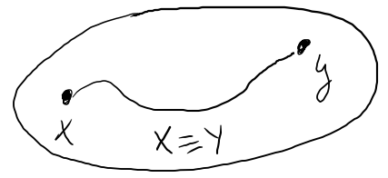
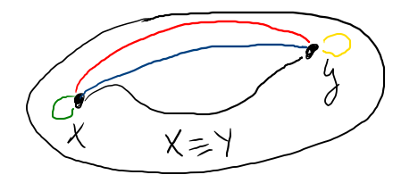
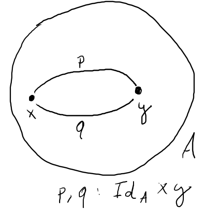
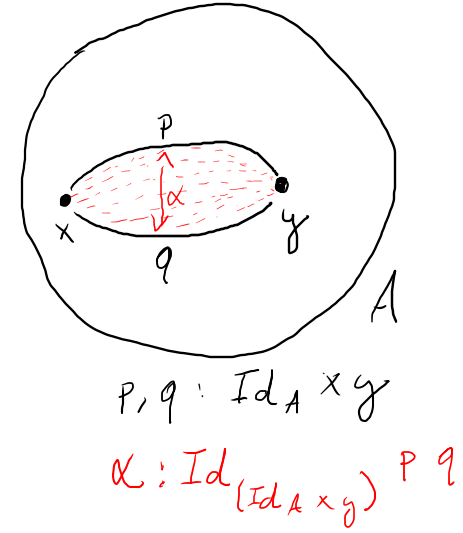
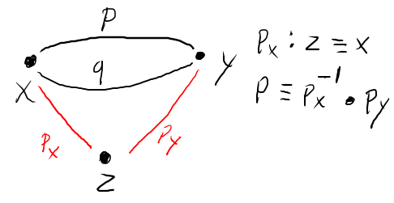

# Objetivos

<!--
```agda
module aula27 where

data Id {U}(A : Set U) : A → A → Set U where
  refl : {x : A} → Id A x x

{-# BUILTIN EQUALITY Id #-}

infix 4 _≡_

_≡_ : ∀ {U}{A : Set U} → A → A → Set U
x ≡ y = Id _ x y
```
-->

## Objetivos

- Apresentar os conceitos principais relativos à Homotopy Type Theory.

- Demonstrar functional extensionality a partir do axioma de univalência.


# Introdução

## Introdução

- O tipo $Id$ na MLTT é crucial para representação de propriedades
e de casamento de padrão em Agda.

## Introdução

- Porém, o mecanismo de casamento de padrão de Agda não é capaz
de provar propriedades importantes sobre o tipo $Id$:
    - UIP
    - Extensionalidade

## Introdução

- Podemos assumir extensionalidade como um postulado sem
comprometer a consistência da MLTT.

## Introdução

- O mecanismo de casamento de padrão de Agda usa o axioma K,
que implica o UIP.

## Introdução

- Porém, além de aplicações na verificação de software,
assistentes de provas tem sido usados com certo sucesso
na matemática.

## Introdução

- Na matemática, a extensionalidade é uma propriedade
fundamental.

## Introdução

- Porém, ao postularmos a extensionalidade, não temos
seu comportamento computacional e isso dificulta as
demonstrações de resultados.

## Introdução

- Como conciliar a MLTT com a extensionalidade?

## Introdução

- Para isso, devemos utilizar outra interpretação da MLTT.

## Introdução

- Vimos que a lógica clássica interpreta proposições como
verdadeiras ou falsas, não se importanto com o conteúdo de
como esta é demonstrável.

## Introdução

- Por sua vez, a lógica intuicionista intepreta proposições
como o conjunto de suas demonstrações.

## Introdução

- Nesse sentido, a construção da demonstração é o elemento
mais importante.

## Introdução

- Porém, a rigor, demonstrações de `x ≡ y` são formadas
por uma única evidência para cada `x : A`.

## Introdução

- Intuitivamente, a UIP faz sentido...

## Introdução

- Hofmann e Streicher elaboraram um modelo de MLTT em que
UIP não é válida.

## Introdução

- Em essência, essa nova semântica da MLTT mostra que
tipos devem ser interpretados como _espaços topológicos_
e não como apenas conjuntos.

## Introdução

- De maneira intuitiva, podemos entender um espaço topológico
como uma superfície sobre dimensões arbitrárias.

## Introdução

- Funções não devem ser entendidas como implicações mas sim
como _funções contínuas_ entre diferentes espaços.

## Introdução

- Igualdades são entendidas como caminhos entre dois pontos em
um espaço.




## Introdução

- Dessa forma, podem existir múltiplas provas de igualdade.



## Introdução

- Resumindo...
    - Tipos são interpretados como espaços.

## Introdução

- Resumindo...
    - Tipos são interpretados como espaços.
    - Valores são intepretados como pontos.

## Introdução

- Resumindo...
    - Tipos são interpretados como espaços.
    - Valores são intepretados como pontos.
    - Funções $f : A \to B$, contínua

## Introdução

- Resumindo...
    - Tipos são interpretados como espaços.
    - Valores são intepretados como pontos.
    - Funções $f : A \to B$, contínua
    - Igualdades como caminhos em um espaço.

## Introdução

- Em superfícies, existem diferentes "caminhos"
entre dois pontos.



## Introdução

- Esses caminhos podem ser equivalentes e, portanto,
faz sentido pensar em _igualdades de igualdades_.

{ height=300px }

## Introdução

- Dizemos que duas funções $f, g : A \to B$ são _equivalentes_
se para todo $x : A$, existe o caminho $f(x) \equiv g(x)$.

- Representamos isso por $f ~ g$ e dizemos que são _homotópicas_.

## Introdução

- Tipos (espaços) $A$ e $B$ são equivalentes, se existem funções
$f : A \to B$ e $g : B \to A$ tais que.
    - $(f \circ g) ~ id_{B}$
    - $(g \circ f) ~ id_{A}$

# Definindo tipos

## Definindo tipos

- Veremos que a igualdade define uma hierarquia de tipos.

## Definindo tipos

- Primeiro, vamos definir o que consideramos como tipo.

```agda
open import Agda.Primitive
 renaming (
            Level to Universe
          ; lzero to U₀
          ; lsuc  to _⁺
          ; Setω  to Uω
          )
 using    (_⊔_) public

Type = λ ℓ → Set ℓ
```

## Definindo tipos

<!--
```agda
record Σ {U V}{A : Type U}(B : A → Type V) : Type (U ⊔ V) where
  constructor _,_
  field
    fst : A
    snd : B fst

open Σ public

_×_ : ∀ {U V} → Type U → Type V → Type (U ⊔ V)
A × B = Σ {A = A}(λ _ → B)
```
-->


- Proposições: tipos isomórficos a $\top$ e $\bot$.

## Definindo tipos

- Conjuntos: tipos que possuem provas de igualdade únicas entre
elementos iguais

## Definindo tipos

- Tipos contractible: tipo contendo um único elemento e uma
única igualdade (identidade)

## Definindo tipos

- Veremos mais detalhes sobre cada uma destas categorias de tipos.

# Proposições

## Proposições

- Se proposições verdadeiras são isomórficas a $\top$, estas
possuem um único elemento.

## Proposições

- Definição de proposição.

```agda
isProp : ∀ {U} → Type U → Type U
isProp A = (x y : A) → x ≡ y
```

## Proposições

- O tipo ⊥ é uma proposição

```agda
data ⊥ : Type U₀ where

⊥-isProp : isProp ⊥
⊥-isProp ()
```
<!--
```agda
¬_ : ∀ {U} → Type U → Type U
¬ A = A → ⊥

data _+_ {U V}(A : Type U)(B : Type V) : Type (U ⊔ V) where
  inl : A → A + B
  inr : B → A + B

ap : ∀ {U V}{A : Type U}{B : Type V}{x y : A}(f : A → B) →
       x ≡ y → f x ≡ f y
ap f refl = refl

⊥-elim : ∀ {U}{A : Type U} → ⊥ → A
⊥-elim ()

open import Basics.Admit

!_ : ∀ {U}{A : Type U} → A
!_ = admit

_∙_ : ∀ {U}{A : Type U} → A
_∙_ = admit

∙-cancel-right : ∀ {U}{A : Type U} → A
∙-cancel-right = admit
```
-->


## Proposições

- O tipo ⊤ é uma proposição

```agda
data ⊤ : Type U₀ where
  ⋆ : ⊤

⊤-isProp : isProp ⊤
⊤-isProp ⋆ ⋆ = refl
```

## Proposições

- O tipo booleano não é uma proposição

```agda
data Bool : Type U₀ where
  true false : Bool

¬Bool-isProp : ¬ (isProp Bool)
¬Bool-isProp PB with PB false true
... | ()
```

## Proposições

- Proposições são fechadas sobre produtos.

```agda
×-isProp : ∀ {U V}{A : Type U}{B : Type V} →
             isProp A → isProp B → isProp (A × B)
×-isProp PA PB (a , b) (a' , b') with PA a a' | PB b b'
...| refl | refl = refl
```

## Proposições

- Somas são fechadas sobre produtos.

```agda
+-isProp : ∀ {U V}{A : Type U}{B : Type V} →
             isProp A →
             isProp B →
             (A → B → ⊥) →
             isProp (A + B)
+-isProp PA PB A→B→⊥ (inl x) (inl y) = ap inl (PA x y)
+-isProp PA PB A→B→⊥ (inl x) (inr y) = ⊥-elim (A→B→⊥ x y)
+-isProp PA PB A→B→⊥ (inr x) (inl y) = ⊥-elim (A→B→⊥ y x)
+-isProp PA PB A→B→⊥ (inr x) (inr y) = ap inr (PB x y)
```

# Conjuntos

## Conjuntos

- O próximo nível da hierarquia de tipos são os tipos
de conjuntos.

## Conjuntos

- Tipos `Set` são tipos em que seus elementos estão em um mesmo
componente conexo ou em componentes conexos diferentes.

## Conjuntos

- Dessa forma, elementos em um mesmo componente conexo são
considerados iguais.

## Conjuntos

- Definição de conjunto.

```agda
isSet : ∀ {U} → Type U → Type U
isSet A = (x y : A) → (p q : x ≡ y) → p ≡ q
```

## Conjuntos

- Booleanos são um conjunto

```agda
Bool-isSet : isSet Bool
Bool-isSet false false refl refl = refl
Bool-isSet true true   refl refl = refl
```

## Conjuntos

- Proposições são tipos que tem apenas um
elemento ou são o conjunto vazio.

## Conjuntos

- Dessa forma, podemos conjecturar que
proposições são conjuntos unitários ou
vazios.

## Conjuntos

- Para isso, vamos mostrar que para igualdades
`p q : x ≡ y` em que `x y : A` e `isProp A`, temos
que `p ≡ q`.

## Conjuntos

- Visualmente



## Conjuntos

- Representando em Agda.

```agda
aProp-is-Set-lem : ∀ {U}{A : Type U}{x y : A} → (P : isProp A) →
                     (z : A)(p : x ≡ y) → p ≡ (! (P z x)) ∙ (P z y)
aProp-is-Set-lem {x = x} P z refl = ! ∙-cancel-right (P z x)
```

## Conjuntos

- Similarmente, podemos mostrar que $q \equiv p_x^{-1} \bullet p_y$.

- E disso deduzimos que $p \equiv q$.

## Conjuntos

- Codificando em Agda.

```agda
aProp-is-Set : ∀ {U}{A : Type U} → isProp A → isSet A
aProp-is-Set {A = A} P x y p q
  = aProp-is-Set-lem P x p ∙ (! aProp-is-Set-lem P x q)
```

## Conjuntos

- Booleanos e proposições são conjuntos.

- É fácil mostrar que números naturais e listas são conjuntos.

## Conjuntos

- O que todos esses tipos anteriores tem em comum?

## Conjuntos

- Todos esses tipos possuem um teste de igualdade.

## Conjuntos

- Todo tipo que possui um função para decidir a igualdade de
valores é um conjunto.

## Conjuntos

- Esse resultado é conhecido como teorema de Hedberg.

## Conjuntos

- Dizemos que um tipo é decidível se `isDec A` é válido.

```agda
isDec : ∀ {U} → Type U → Type U
isDec A = A + ¬ A
```

## Conjuntos

- Definição de um tipo ter igualdade decidível

```agda
isDecEq : ∀ {U}(A : Type U) → Type U
isDecEq A = (x y : A) → isDec (x ≡ y)
```

## Conjuntos

- Dupla negação

```agda
isNNE : ∀ {U} → Type U → Type U
isNNE A = (¬ (¬ A)) → A
```

## Conjuntos

- Decidibilidade da dupla negação

```agda
isNNEq : ∀ {U} → Type U → Type U
isNNEq A = (x y : A) → isNNE (x ≡ y)
```

## Conjuntos

- Decidibilidade implica a dupla negação

```agda
isDecEq-isNNE : ∀ {U}{A : Type U} → isDec A → isNNE A
isDecEq-isNNE (inl a) a' = a
isDecEq-isNNE (inr a) a' = ⊥-elim (a' a)
```

## Conjuntos

- Relacionando a igualdade e dupla negação

```agda
nneId : ∀ {U}{A : Type U} → isNNEq A → {x y : A} →
            (p : x ≡ y) → x ≡ y
nneId N {x}{y} p = N x y (λ k → k p)
```

## Conjuntos

- Relacionando a igualdade e dupla negação

```agda
nneIdCannonical : ∀ {U}{A : Type U} → (N : isNNEq A) →
                    {x y : A}(p q : x ≡ y) → nneId N p ≡ nneId N q
nneIdCannonical N {x}{y} p q = ap (N x y)
                                  (¬-isProp (λ k → k p)
                                            (λ k → k q))
```

## Conjuntos

- Relacionando a igualdade e dupla negação

```agda
nneIdEq : ∀ {U}{A : Type U}(N : isNNEq A){x y : A}(p : x ≡ y) →
            p ≡ ! (nneId N refl) ∙ nneId N p
nneIdEq N {x}{y} refl = ! ∙-cancel-right (N x x (λ z → z refl))
```

## Conjuntos

- Prova do teorema de Hedberg

```agda
Hedberg : ∀ {U}{A : Type U}(N : isNNEq A) → isSet A
Hedberg N x y p q
  = begin
      p
           ≡⟨ nneIdEq N p ⟩
      (! (nneId N refl) ∙ (nneId N p))
           ≡⟨ ap (λ nnp → ! (nneId N refl) ∙ nnp)
                 (nneIdCannonical N p q) ⟩
      (! (nneId N refl) ∙ (nneId N q))
           ≡⟨ (! (nneIdEq N q)) ⟩
      q
    ∎
```

# Contractible

## Contractible

- Um tipo é contractible se este possui,
no máximo único elemento.

## Contractible

- Definição de contractible types.

```agda
isContr : ∀ {U} → Type U → Type U
isContr A = Σ {A = A} (λ x → (y : A) → x ≡ y)
```

## Contractible

- O tipo ⊤ é contractible.

```agda
⊤-isContr : isContr ⊤
⊤-isContr = ⋆ , (λ { ⋆ → refl})
```

## Contractible

- Singletons são contractible

```agda
Singleton : ∀ {U}{A : Type U} → A → Type U
Singleton {A = A} x = Σ {A = A} (λ y → x ≡ y)

Singleton-isContr : ∀ {U}{A : Type U}(x : A) → isContr (Singleton x)
Singleton-isContr x = (x , refl) , (λ {(y , refl) → refl})
```

## Contractible

- Tipos contractible são proposições

```agda
Contr-isProp : ∀ {U}{A : Type U} → isContr A → isProp A
Contr-isProp (x , p) y z with p y | p z
...| refl | refl = refl
```

# Truncation

## Truncation

- Truncation é uma operação que converte um tipo qualquer
em uma proposição.

## Truncation

- Um termo de tipo `e : A` representa uma evidência de que
`A` é demonstrável.

## Truncation

- O truncation `∥ A ∥` denota que _existe_ uma evidência
para demonstrar `A`.

## Truncation

- Infelizmente, no Agda _padrão_ não podemos definir o
truncation.

## Truncation

- Definindo truncation

```agda
postulate ∥_∥ : ∀ {U} → Type U → Type U
postulate ∥∥-isProp : ∀ {U}(A : Type U) → isProp ∥ A ∥
```

## Truncation

- Construindo valores usando truncation.

```agda
postulate ∣_∣ : ∀ {U}{A : Type U} → A → ∥ A ∥
```

## Truncation

- Eliminação

```agda
postulate ∥∥-rec : ∀ {U V}{A : Type U}{B : Type V} →
                   isProp B → (A → B) → (∥ A ∥ → B)
```

## Truncation

- Regras de computação

```agda
postulate ∥∥-comp : ∀ {U V}{A : Type U}{B : Type V} →
                    (P : isProp B)(f : A → B)(x : A) →
                    ∥∥-rec P f ∣ x ∣ ≡ f x
```

## Truncation

- Usando truncation, podemos definir a disjunção,
sem considerar que os tipos são disjuntos.

```agda
_∨_ : ∀ {U V} → Type U → Type V → Type (U ⊔ V)
A ∨ B = ∥ A + B ∥
```

## Truncation

- De maneira simples, truncation "apaga" a informação
de deduções.

- Mantendo apenas o fato de sua existência.

## Truncation

- Porém, em algumas situações, a partir da "existência"
pode-se obter a evidência.

## Truncation

- Exemplo: A partir de uma função $f : \mathbb{N} \to \mathbb{N}$
e do fato que $f(n) = 0$, podemos reconstruir raízes de $f$.

## Truncation

- Representando em HTT:

$$
\|\Sigma\,(n\,:\,\mathbb{N}).f(n) = 0\| \Rightarrow \Sigma\,(n\,:\,\mathbb{N}).f(n) = 0
$$

## Truncation

- A ideia é encontrar a menor raiz para uma certa função $f$
que possui raízes.

## Truncation

- Primeiro, vamos definir um tipo que denota deduções do menor número que satisfaz
um predicado.

```agda
isFirst : ∀ {U}(P : ℕ → Type U) → ℕ → Type U
isFirst P n = P n × ((m : ℕ) → P m → n ≤ m)
```

## Truncation

- Tipo para denotar que a menor raiz é unica.

```agda
isFirst-≡ : ∀ {U}(P : ℕ → Type U){m n : ℕ} →
            isFirst P m → isFirst P n → m ≡ n
isFirst-≡ P {m}{n} (Pm , Fm) (Pn , Fn)
  = ≤-antisym (Fm n Pn) (Fn m Pm)
```

## Truncation

- Mostrando que `isFirst` é uma proposição

```agda
first-isProp : ∀ {U}(P : ℕ → Type U) →
                 ((n : ℕ) → isProp (P n)) →
                 isProp (Σ (isFirst P))
first-isProp P prop
  = Σ-isProp (λ n → ×-isProp
                  (prop n)
                  (Π-isProp (λ n →
                    Π-isProp (λ Pn → ≤-isProp))))
             (λ n m → isFirst-≡ P)
```

## Truncation

- Tipo de um número menor que k, satisfazendo `P`.

```agda
isFirst-from : ∀ {U} → ℕ → (P : ℕ → Type U) → ℕ → Type U
isFirst-from k P n = isFirst (λ n → (k ≤ n) × P n) n
```

## Truncation

- Recursão descrescente.

```agda
rec-down : ∀ {U}(P : ℕ → Type U)(m : ℕ) → P m     →
             ((n : ℕ) → n < m → P (suc n) → P n) →
             (n : ℕ) → n ≤ m → P n
rec-down P zero Pm IH .0 z≤n = Pm
rec-down P (suc m) Pm IH .0 z≤n
  = IH zero (s≤s z≤n)
            (rec-down (λ z → P (suc z)) m Pm (λ n z → IH (suc n) (s≤s z)) zero
                             z≤n)
rec-down P (suc m) Pm IH .(suc _) (s≤s n≤m)
  = rec-down (λ z → P (suc z))
             m
             Pm
             (λ n z → IH (suc n)
             (s≤s z)) _ n≤m
```

## Truncation

- Encontrando a primeira raiz de uma equação.

```agda
find-first-from : ∀ {U}(P : ℕ → Type U) → ((n : ℕ) → isDec (P n)) →
                    (m : ℕ) → P m → (k : ℕ) → k ≤ m →
                    Σ {A = ℕ} (λ n → isFirst-from k P n)
find-first-from P dec m Pm k k≤m
  = rec-down (λ k → Σ (λ n → isFirst-from k P n))
             m
             (m , ((≤-refl , Pm) , λ { _ (m≤n , _ ) → m≤n}))
             IH
             k
             k≤m
```

## Truncation

- Encontrando a primeira raiz (caso base da definição).

```agda
find-first : ∀ {U}(P : ℕ → Type U) →
             ((n : ℕ) → isDec (P n)) →
             (m : ℕ) → P m → Σ (isFirst P)
find-first P dec m Pm with find-first-from P dec m Pm 0 z≤n
... | n , ((_ , Pn) , Fn)
  = n , (Pn , (λ x x₁ → Fn x (z≤n , x₁)))
```

## Truncation

- Encontrando a menor raiz, usando truncation.

```agda
extract-first-root : ∀ (f : ℕ → ℕ) →
                     ∃ ℕ (λ n → f n ≡ 0) →
                     Σ (isFirst (λ n → f n ≡ 0))
extract-first-root f E
  = ∥∥-rec (first-isProp P (λ n → ℕ-isSet (f n) 0))
           (λ {(n , Pn) → find-first P (λ n → f n ≟ 0) n Pn})
           E
    where
      P : ℕ → Type U₀
      P n = f n ≡ 0
```

## Truncation
