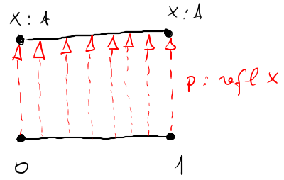
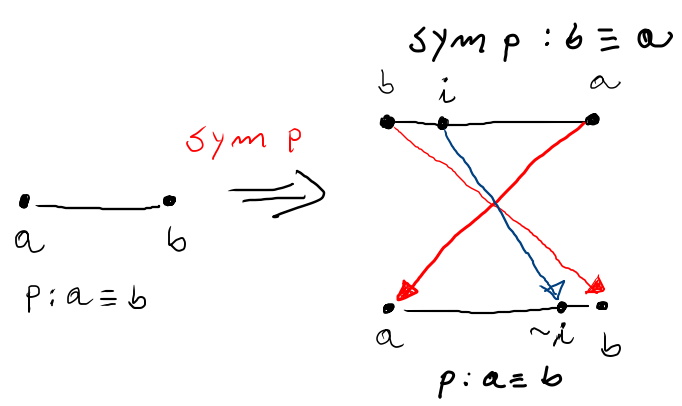
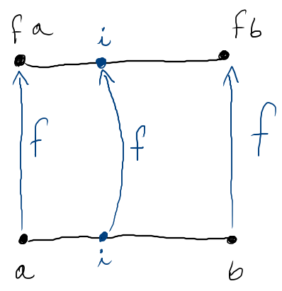
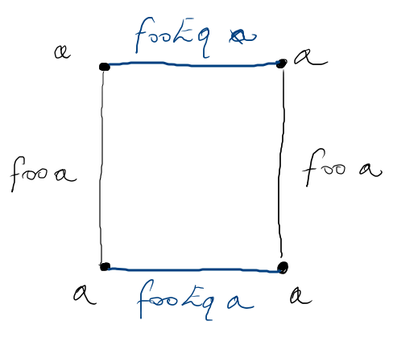
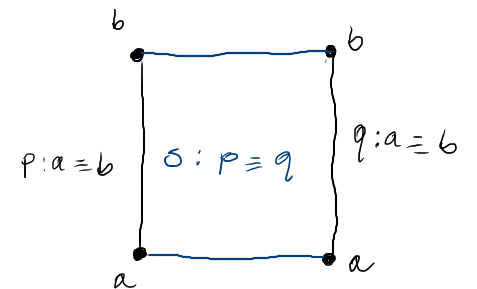
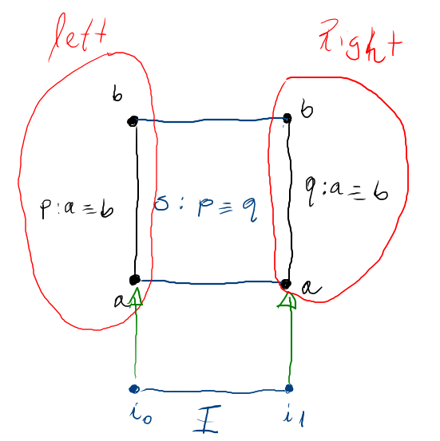

# Objetivos

<!--
```agda
{-# OPTIONS --cubical #-}
module aula28 where

open import Agda.Primitive.Cubical renaming ( primINeg  to ~_
                                            ; primHComp to trans
                                            )
```
-->

## Objetivos

- Apresentar Cubical Agda, uma extensão de Agda com suporte a HTT.

- Apresentar o conceito de Higher inductive types.

# Introdução

## Introdução

- Vimos em aulas anteriores que o tratamento da igualdade é um
elemento central em assistentes de provas.

## Introdução

- Em Agda, a igualdade é representada pelo tipo _≡_ que possui
um único construtor:
    - `refl : ∀ {x : A} → x ≡ x`.

## Introdução

- Porém, a igualdade em MLTT não permite a demonstração de propriedades
interessantes como a extensionalidade.
   - Fundamental em matemática.

## Introdução

- Nesse contexto, surgiu a HTT como uma tentativa de conciliar a MLTT com
a prática matemática atual.
    - Problema: dependência do axioma de univalence.

## Introdução

- Pergunta: qual seria o conteúdo computacional de univalence?

## Introdução

- A resposta foi dada em artigo que interpreta a teoria de tipos em
conjuntos cúbicos.

## Introdução

- Não será nosso objetivo entrar em detalhes de como a teoria de tipos
é entendida nessa semântica.

## Introdução

- Apresentaremos uma visão de alto nível de como a nova interpretação
da igualdade permite a formalização de resultados da matemática e
discutiremos aplicações em computação.

## Introdução

- Para utilizar a versão cubical de Agda é necessário utilizar o pragma:
--cubical.

# Path types

## Path types

- A ideia central da cubical type theory (CTT) é a definição do
conceito de _interval type_.

## Path types

- O tipo `I` denota o intervalo real $[0,1]$:
    - `i0 : I` denota o número $0$.
    - `i1 : I` denota o número $1$.

## Path types

- Não é possível realizar casamento de padrão sobre valores `I`.

## Path types

- Para manipular valores `I` usamos algumas operações:

$$
\begin{array}{lcll}
\_\land\_ & : & I \to I \to I & \textit{mínimo}\\
\_\lor\_  & : & I \to I \to I & \textit{máximo}\\
\sim\_    & : & I \to I       & \textit{inversão}\\
\end{array}
$$

## Path types

- Regras computacionais sobre `I`.

$$
\begin{array}{lcl}
i0 \lor i  & = & i \\
i  \lor i1 & = & i \\
i  \lor j  & = & j \lor i \\
\end{array}
$$

## Path types

- Regras computacionais sobre `I`.

$$
\begin{array}{lcl}
i0 \land i  & = & i0 \\
i  \land i1 & = & i \\
i  \land j  & = & j \land i \\
\end{array}
$$

## Path types

- Regras computacionais sobre `I`.

$$
\begin{array}{lcl}
\sim (\sim\:i)   & = & i \\
i0               & = & \sim i1 \\
\sim (i \lor j)  & = & \sim i \land \sim j \\
\sim (i \land j) & = & \sim i \lor \sim j
\end{array}
$$

## Path types

- Usando o tipo I podemos representar igualdades como
caminhos na topologia.

## Path types

- Essa representação é feita associando o intervalo `I`,
a tipos `A` quaisquer.

## Path types

- Definição de caminhos: postulado implementado internamente
pelo compilador de Agda.

```agda
postulate PathP : ∀ {ℓ} (A : I → Set ℓ) → A i0 → A i1 → Set ℓ
{-# BUILTIN PATHP        PathP     #-}
```

## Path types

- Definição do tipo Path (igualdade).

```agda
infix 4 _≡_

_≡_ : ∀ {ℓ} {A : Set ℓ} → A → A → Set ℓ
_≡_ {A = A} = PathP (λ i → A)

{-# BUILTIN PATH         _≡_     #-}
```

## Path types

- Definição da reflexividade

```agda
refl : ∀ {ℓ} {A : Set ℓ} {x : A} → x ≡ x
refl {x = x} = λ i → x
```

## Path types

- Intuição geométrica




## Path types

- Simetria de paths

```agda
sym : ∀ {l}{A : Set l}{x y : A} → x ≡ y → y ≡ x
sym p = λ i → p (~ i)
```

## Path types

- Intuição geométrica



## Path types

- Definindo a congruência

```agda
cong : ∀ {A : Set}{B : A → Set}{x y : A}
       (f : (a : A) → B a) (p : x ≡ y) →
       PathP (λ i → B (p i)) (f x) (f y)
cong f p i = f (p i)
```

## Path types

- Intuição geométrica



## Path types

- Usando essa representação da igualdade, podemos demonstrar a
extensionalidade.

```agda
funext : ∀ {l}{A B : Set l}{f g :  A → B}
           (p : ∀ a → f a ≡ g a) → f ≡ g
funext p = λ i a → p a i
```

## Path types

- Um bom exercício é tentar entender a definição anterior
geometricamente.

## Path types

- Como a igualdade é uma função sobre um intervalo,
alguns resultados são válidos por definição

```agda
symInv : ∀ {l}{A : Set l}{x y : A}(p : x ≡ y) → sym (sym p) ≡ p
symInv p = refl
```

# Squares

## Squares

- Seguindo a intuição geométrica da CTT, uma igualdade é um
caminho entre dois pontos (valores de um tipo).

## Squares

- O que seria uma igualdade de caminhos?

## Squares

- Igualdades entre caminhos formam _quadrados_!

## Squares

- De maneira análoga, igualdades entre igualdades de igualdades,
formam _cubos_...

## Squares

- Definindo um caminho simples

```agda
foo : ∀ {A : Set}(x : A) → x ≡ x
foo x = refl
```

## Squares

- Definindo um _quadrado constante_

```agda
fooEq : ∀ {A : Set}(x : A) → foo x ≡ foo x
fooEq x = λ i j → x
```

## Squares

- Intuição geométrica



## Squares

- Vamos considerar um exemplo com pontos arbitrários de um tipo `A`

## Squares

- Definindo um quadrado.

```agda
module MySquare {A : Set}
                {a b : A}
                (p q : a ≡ b)
                (s : p ≡ q) where
```

## Squares

- Intuição geométrica



## Squares

- Definindo a aresta à esquerda usando o ponto `i0`.

```agda
  left : a ≡ b
  left = s i0

  _ : left ≡ p
  _ = refl
```

## Squares

- Definindo a aresta à direita usando o ponto `i1`.

```agda
  right : a ≡ b
  right = s i1

  _ : right ≡ q
  _ = refl
```

## Squares

- Intuição geométrica

{height=320px}


## Squares

- Usando `sym`, podemos definir uma
rotação em $180^{o}$ do quadrado definido por
`p` e `q`

```agda
  rotate : (sym q) ≡ (sym p)
  rotate = λ i j → s (~ i) (~ j)
```

## Squares

- Concluindo: Cubical Agda permite a manipulação de
igualdades com uma fundamentação geométrica.

- Isso é útil para a formalização de resultados da
matemática moderna.


# High inductive types

## High inductive types

- Na matemática, podemos construir o conjunto dos
números inteiros usando o conjunto dos naturais.

## High inductive types

- Podemos representar inteiros como:

```agda
data ℕ : Set where
  zero : ℕ
  suc  : ℕ → ℕ

{-# BUILTIN NATURAL ℕ #-}

data ℤ1 : Set where
  pos : ℕ → ℤ1
  neg : ℕ → ℤ1
```

## High inductive types

- Problema: Usando o tipo `ℤ1` temos dois valores para representar 0:
    - `pos 0`
    - `neg 0`
- Como resolver esse problema?

## High inductive types

- Podemos evitar esse problema usando uma definição que impõe
`pos 0 ≡ neg 0`.

- Tipos de dados que possuem igualdades como construtores são
HITs.

## High inductive types

- Representando inteiros como HITs

```agda
data ℤ : Set where
  pos : ℕ → ℤ
  neg : ℕ → ℤ
  zero : pos 0 ≡ neg 0
```

## High inductive types

- Exemplo: definindo a operação de sucessor.

```agda
sucℤ : ℤ → ℤ
sucℤ (pos n) = pos (suc n)
sucℤ (neg 0) = pos 1
sucℤ (neg (suc n)) = neg n
sucℤ (zero i) = pos 1
```

## High inductive types

- O constructor `zero` é uma igualdade.

- Logo, `zero` possui um valor `i : I` como parâmetro.

## High inductive types

- A ideia é que `zero` quando aplicado a `i0` reduz para `pos 0` e
para `neg 0` quando aplicado a `i1`.

```agda
_ : (zero i0) ≡ (pos 0)
_ = refl {A = ℤ}

_ : (zero i1) ≡ (neg 0)
_ = refl {A = ℤ}
```

## High inductive types

- É importante notar que funções que usam HITs devem respeitar
igualdades impostas por seus construtores.

## High inductive types

- A função `sucℤ` é tal que a seguinte igualdade é válida:
    - sucℤ (pos 0) = subℤ (neg 0) = pos 1

## High inductive types

- A representação de estruturas de dados para conjuntos
é complicada em computação.

- Normalmente a solução é dada em termos de árvores de busca.

## High inductive types

- Usando HITs podemos definir um tipo para conjuntos finitos
de forma direta.

- Primeiro os construtores de dados:

```agda
infixr 10 _∷_

data FSet (A : Set) : Set where
  ∅   : FSet A
  _∷_ : A → FSet A → FSet A
```

## High inductive types

- Construtores de caminhos (igualdades)

```agda
  dup : ∀ a xs → a ∷ a ∷ xs ≡ a ∷ xs
  com : ∀ a b xs → a ∷ b ∷ xs ≡ b ∷ a ∷ xs
```

## High inductive types

- Exemplo: map sobre FSets

```agda
map : ∀ {A B} → (A → B) → FSet A → FSet B
map f ∅ = ∅
map f (x ∷ xs) = f x ∷ map f xs
map f (dup x xs i) = dup (f x) (map f xs) i
map f (com x y xs i) = com (f x) (f y) (map f xs) i
```

## High inductive types

- Exemplo: concatenação

```agda
_++_ : ∀ {A} → FSet A → FSet A → FSet A
∅ ++ ys = ys
(x ∷ xs) ++ ys = x ∷ (xs ++ ys)
dup a xs i ++ ys = dup a (xs ++ ys) i
com a b xs i ++ ys = com a b (xs ++ ys) i
```

# Conclusão

## Conclusão

- Apresentamos uma breve introdução ao Cubical Agda.

- Os exemplos apresentados são simples, porém a linguagem é capaz de
formalizar resultados não triviais da matemática moderna.

## Conclusão

- O tema de homotopy type theory e suas interpretações computacionais é um tema amplamente
estudado por diversos grupos.

## Conclusão

- Agradeço a todos pela participação neste curso!

{height=280px}

# Referências

## Referências

- Cyril Cohen, Thierry Coquand, Simon Huber and Anders Mörtberg;
"Cubical Type Theory: a constructive interpretation of the univalence axiom".
